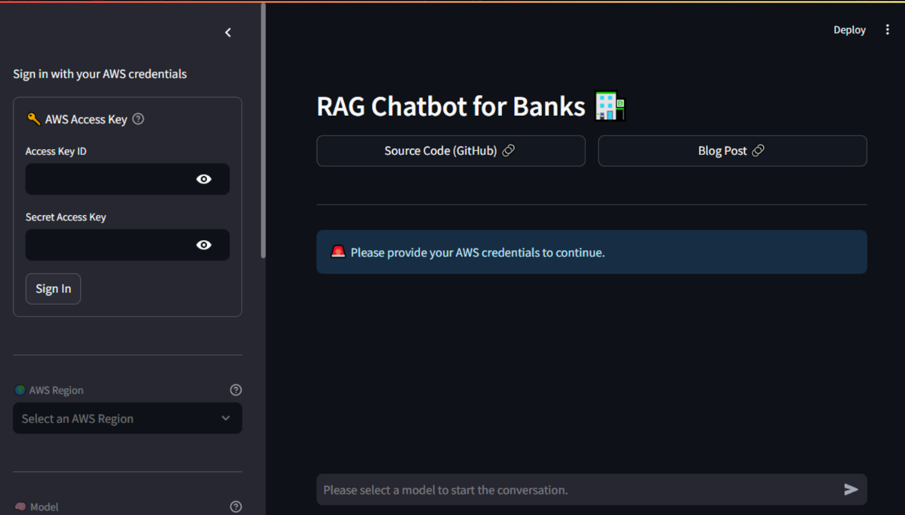

<a name="readme-top"></a>

<!-- PROJECT LOGO -->
<br />
<div align="center">
  <a href="https://github.com/NILodio/rag-chatbot-banks">
    
  </a>

<h3 align="center">Canada Banks RAG Chatbot</h3>

This project is about creating a chatbot that makes it easier to explore and understand financial reports from trusted Canadian banks such as RBC, CIBC, TD, and more. Built with privacy and security in mind, the chatbot is designed to work in a secure environment, ensuring compliance with industry regulations. By using advanced AI techniques such as RAG for LLMs, it helps professionals save time by summarizing and highlighting key insights from lengthy reports. This tool was built with a focus on scalability and future updates.

  <p align="center">
    <br />
    <a href="https://github.com/NILodio/rag-chatbot-banks/issues">Report Bug</a>
    ·
    <a href="https://github.com/NILodio/rag-chatbot-banks/issues">Request Feature</a>
  </p>
</div>

## About The Project

<div align="center">
  
</div>
Using a combination of advanced technologies to build a chatbot that extracts, summarizes, and provides insights from financial reports published by major Canadian banks like RBC, CIBC, and TD, and more. Our pipeline started by processing thousands of PDFs web scrapped from the banks websites. These are converted into a vector store for efficient data retrieval. It utilizes Retrieval-Augmented Generation (RAG) to store relevant information, with a conversation buffer memory that tracks previous interactions and feeds them into the selected LLM along with the current user query. <br>
The user interface is developed using Streamlit, offering a simple and interactive experience. The solution is deployed on AWS services, leveraging S3 to store thousands of bank reports and Bedrock for scalable AI model management. This architecture ensures secure and compliant data handling while providing fast analysis to financial professionals. The system also integrates MLOps to support continuous updates and model deployment, making it a scalable tool for automating financial report analysis.
<p align="right">(<a href="#readme-top">back to top</a>)</p>

### Built With

* 
* 
* 
* 
* 
* 
* 
* ![JupyterLab][jupyter-badge]

[jupyter-badge]: https://img.shields.io/badge/jupyter-book-orange?logo=data:image/png;base64,iVBORw0KGgoAAAANSUhEUgAAABwAAAAZCAMAAAAVHr4VAAAAXVBMVEX////v7+/zdybv7+/zdybv7+/zdybv7+/zdybv7+/zdybv7+/zdybv7+/zdybv7+/zdybv7+/zdybv7+/v7+/zdybv7+/zdybv7+/v7+/zdybv7+/zdybv7+/zdyaSmqV2AAAAHXRSTlMAEBAgIDAwQEBQUGBgcHCAgJCQoLCwwMDQ4ODw8MDkUIUAAADJSURBVHjaddAFkgNBCAXQP+7uAvc/5tLFVseYF8crUB0560r/5gwvjYYm8gq8QJoyIJNwlnUH0WEnART6YSezV6c5tjOTaoKdfGXtnclFlEBEXVd8JzG4pa/LDql9Jff/ZCC/h2zSqF5bzf4vqkgNwEzeClUd8uMadLE6OnhBFsES5niQh2BOYUqZsfGdmrmbN+TMvPROHUOkde8sEs6Bnr0tDDf2Roj6fmVfubuGyttejCeLc+xFm+NLuLnJeFAyl3gS932MF/wBoukfUcwI05kAAAAASUVORK5CYII=


<p align="right">(<a href="#readme-top">back to top</a>)</p>

## Roadmap

- [ ] Enhancing User Interaction & Interface; Refine the Streamlit interface to improve user experience
- [ ] Update data extraction script to filter only document with useful information regarding financial reports
- [ ] MLOps Integration & Continuous Updates; Ensure real-time updates and scalability for future bank reports.

We are always open for any suggestions. Please, add them on the [issues section](https://github.com/NILodio/rag-chatbot-banks).

<p align="right">(<a href="#readme-top">back to top</a>)</p>

## Getting Started

### Deploy RAG/AI App To AWS - Configure AWS

You need to have an AWS account, and AWS CLI set up on your machine. You'll also need to have Bedrock enabled on AWS (and granted model access to Claude or whatever you want to use).

### Update .env File with AWS Credentials

Create a file named `.env` you can use .env.example as a template:

```
AWS_ACCESS_KEY_ID=xxxxxxxxxxxxxxxxxxxxxxxxxxxxxxxxxxxxxxxx
AWS_SECRET_ACCESS_KEY=xxxxxxxxxxxxxxxxxxxxxxxxxxxxxxxxxxxxxxxx
AWS_REGION=us-east-1
AWS_BUCKET_NAME=rag-chatbot-banks
PREFECT_BLOCK_AWS_CREDENTIALS=rbc-prefect-aws-credentials
PREFECT_BLOCK_S3_BUCKET=rcb-prefect-s3-bucket
PREFECT_API_KEY=xxxxxxxxxxxxxxxxxxxxxxxxxxxxxxxxxxxxxxxx
PREFECT_API_URL=xxxxxxxxxxxxxxxxxxxxxxxxxxxxxxxxxxxxxxxx
```

This will be used by Docker for when we want to test the image locally. The AWS keys are just your normal AWS credentials and region you want to run this in (even when running locally you will still need access to Bedrock LLM and to the DynamoDB table to write/read the data).

You'll also need a TABLE_NAME for the DynamoDB table for this to work (so you'll have to create that first).

### Installing Requirements

```sh
made develop
```

### Building the Vector DB

Put all the PDF source files you want into `data/source/`.

```sh
# Use "--reset" if you want to overwrite an existing DB.
python src/scripts/main.py populate-database data/chroma data/source --clear
```

### Running the App

```sh
# Execute from image/src directory
python src/scripts/main.py query-rag "How much was the net income in Q3 2024 vs Q3 2023 for RBC"
```

Example output:

```text
Based on the provided context, the total revenue in Q1 2024 compared to Q4 2023 increased in all three scenarios:\n\n1. In the first scenario, total revenue increased by $387 million or 15% from the previous quarter.\n\n2. In the second scenario, total revenue increased by $800 million or 6% from the previous quarter.\n\n3. In the third scenario, total revenue increased by $349 million or 8% from the previous quarter.\n\nTherefore, the total revenue in Q1 2024 increased compared to Q4 2023.
```

### Amazon Bedrock Setup

This chatbot requires:
- AWS credentials with access to the Amazon Bedrock API
- Requesting access to a model provided by Amazon Bedrock
- Access to an S3 bucket where the documents will be stored
- Configuring a Vector Store for the Knowledge Base

The first two requirements should be enough for general conversations while
the rest are needed for document based conversations.

#### Step 1: Create an AWS account([docs](https://aws.amazon.com/free/))

#### Step 2: Create an IAM user ([docs](https://docs.aws.amazon.com/IAM/latest/UserGuide/id_users_create))

#### Step 3: Attach the `AmazonBedrockFullAccess` policy to the IAM user  ([docs](https://docs.aws.amazon.com/apigateway/latest/developerguideapi-gateway-create-and-attach-iam-policy))

#### Step 4: Create an access key for the IAM user ([docs](https://docs.aws.amazon.com/IAM/latest/UserGuide/id_credentials_access-keys))

#### Step 5: Request access to a model provided by Amazon Bedrock ([docs](https://docs.aws.amazon.com/bedrock/latest/userguide/model-access))

You can already navigate back to your browser and start interacting with the
chatbot for general conversations using this access key. Follow the
instructions displayed in the chatbot interface to start the conversation.
This will require authenticating using the access key and selecting both the
region and the model you have access to. Remember, the model you requested
access to was also grouped under a specific region. Make sure to select that
same region in the chatbot interface.

> [!WARNING]
> Depending on the model, AWS will charge you based on usage. Although we might
> talk about pennies here, it's always good to keep an eye on the costs as
> pennies can easily turn into dollars if you're not careful.
> For text-generation models, such as those we are using here, you will be
> charged for every input token processed and every output token generated. For
> more information on pricing, have a look [here](https://aws.amazon.com/bedrock/pricing).

## Creating a Knowledge Base for Document Based Conversations

To enable document based conversations, you need to create a Knowledge Base
in Amazon Bedrock, upload the documents to an S3 bucket attached to that
Knowledge Base as well as configuring a Vector Store.

#### Step 1: Attach the `AmazonS3FullAccess` policy to the IAM user ([docs](https://docs.aws.amazon.com/apigateway/latest/developerguide/api-gateway-create-and-attach-iam-policy)).

#### Step 2: Create an S3 bucket ([docs](https://docs.aws.amazon.com/AmazonS3/latest/userguide/create-bucket-overview.html)).

#### Step 3: Attach the `IAMFullAccess` policy to your IAM user ([docs](https://docs.aws.amazon.com/apigateway/latest/developerguide/api-gateway-create-and-attach-iam-policy)).

> [!CAUTION]
> Please note that we are giving our IAM user too much power here. This is just
> for the sake of simplicity. In a real-world scenario, you would want to follow
> the principle of least privilege and only grant the necessary permissions. For
> example, there is no need for full access to all S3 buckets, just the ones you
> want to use. The same applies tenfold for the `IAMFullAccess` policy. This one
> is added just to avoid an issue while creating the Knowledge Base and it is
> related to creating an IAM role that will handle the permissions for the
> actions performed by the Knowledge Base. You can, and probably should, remove
> the `IAMFullAccess` policy after the Knowledge Base is created. The other two
> (`AmazonBedrockFullAccess` and `AmazonS3FullAccess`) are needed for the
> chatbot to function properly. As a side note, root users cannot create
> Knowledge Bases and this is the reason behind the hustle of creating and
> properly configuring this IAM user.


#### Step 4: Navigate to the Amazon Bedrock console to create a Knowledge Base

Search for `Amazon Bedrock` in the AWS Management Console and click on it.
Next, click on `Get started` and you will find yourself in the main dashboard
of the Bedrock console. Click on `Knowledge bases` in the left-hand menu and
then on `Create Knowledge Base`.

#### Step 5: Providing the Knowledge Base Details

You can give your Knowledge Base a name and a description (optional) but
other than that, proceed with the default settings. Notice that `Amazon S3`
is selected as the data source type. Hit `Next`.

#### Step 6: Configuring the Data Source

Click on `Browse S3` and select the bucket you created earlier. Once again,
proceed with the default settings for the rest of the options.

#### Step 7: Selecting an Embeddings Model

Select one of the available embeddings models. For this tutorial, we'll go
on with the default one provided by Amazon (`Titan Embeddings G1 - Text v1.2`).
You are free to select any other model but I would strongly suggest sticking
with the default one as some of the next steps will depend on it.

#### Step 8: Configuring the Vector Store

This is probably the most demanding step in terms of configuration. You can
either proceed with the default one provided by Amazon (`Amazon OpenSearch
Serverless vector store`) or create your own. Although the default one seems
tempting, there are some caveats to it. Amazon is, at the time of writing,
actively improving the pricing algorithms for this service but it might still
be a bit expensive for simple use cases such as our own. For more information,
have a look [here](https://aws.amazon.com/opensearch-service/pricing/).

That being said, we will proceed using `Pinecone` as our vector store and
leverage their free tier, which is more than enough for our use case. To be
able to do so, you need to create a `Pinecone` account first. Visit their
website [here](https://www.pinecone.io/) and sign up. Once you have an
account, log in and create a new index. To do so, select `Indexes` from the
left-hand menu and then click on `Create index`.

Give your index a name and assign `1536` as the value for the `Dimension`
field. Hit `Create index` and you are good to go. This is the exact same value
as the one in the `vector dimensions` field for the `Titan Embeddings G1 - Text
v1.2` model back in the Bedrock console. This is not a coincidence. The vector
store needs to have the same dimensionality as the embeddings model. This is
crucial for the RAG technique to work properly.

Hit `Create index`. Once the index is created, copy the `Host` value at the
top and head back to the Bedrock console. Paste the `Host` value in the
`Endpoint URL` as shown below.

For the next field (`Credentials secret ARN`), you need to create a secret in
AWS `Secrets Manager`. This secret will hold the API key for your Pinecone
index in an encrypted form. To do so, search for `Secrets Manager` in the AWS
Management Console and click on it. Next, click on `Store a new secret` and
select `Other type of secret`. For the `Key/value` pair, it's crucial that the
key is `apiKey` spelled exactly like that. For the value, paste the API key
you got from Pinecone. Hit `Next` and follow the rest of the steps to create
the secret. Once the secret is created, copy its `Secret ARN` and paste it in
the `Credentials secret ARN` field back in the Bedrock console.

Use the default values suggested for the last two required fields:

- Text field name: `text`
- Bedrock-managed metadata field name: `metadata`

and hit `Next`.

Make sure everything is set up as expected and hit `Create Knowledge Base`.

## Utilizing the Knowledge Base

Head back to the chatbot and select your newly created Knowledge Base from the
selector.

Knowledge base search mode is now enabled. In this mode, the chatbot will only
respond based on the context of the documents in your Knowledge Base. If no
relevant information is found, the chatbot will respond with a generic message
stating that it cannot assist you with that request. Let's upload a document
and see how the chatbot can help us with it.

Right below the Knowledge Base selector, select a data source (the S3 bucket
you created and attached to the Knowledge Base earlier) and upload a document.

Hit `Upload & Sync`.

The document is being uploaded to the S3  bucket and then processed by the
Knowledge Base. In other words, the document has been read and understood by
the chatbot. Go ahead and ask a question related to the document you just
uploaded!


<!-- CONTACT -->
## Contact
* Danilo Diaz - [GitHub Profile](https://github.com/NILodio)
* Aanal Patel - [GitHub Profile](https://github.com/Aanalpatel99)
* Bimal Shrestha - [GitHub Profile](https://github.com/bimalstha0)
* Ernie Sumoso - [GitHub Profile](https://github.com/ErnieSumoso)
* Jay Saravanan - [GitHub Profile](https://github.com/svjai)

Project Link: https://github.com/NILodio/rag-chatbot-banks
